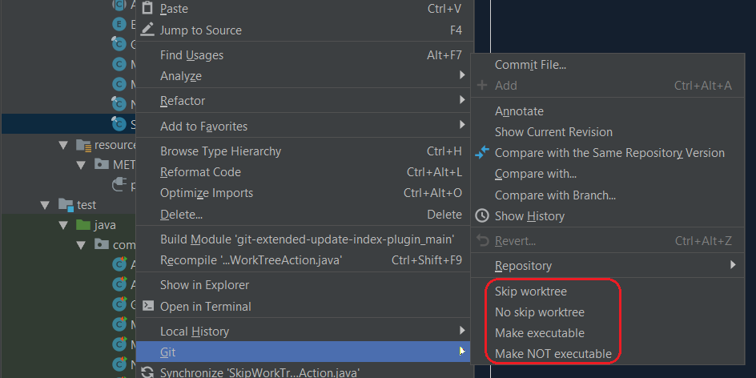
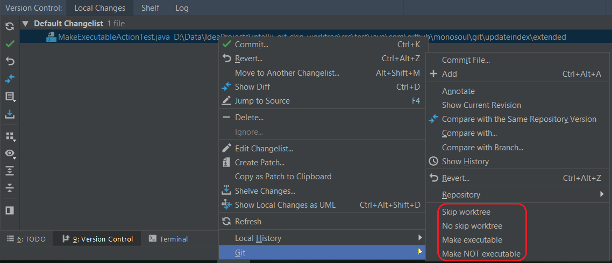
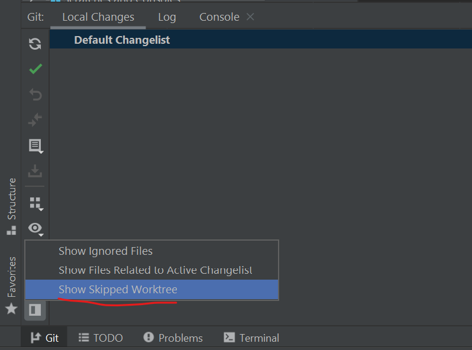
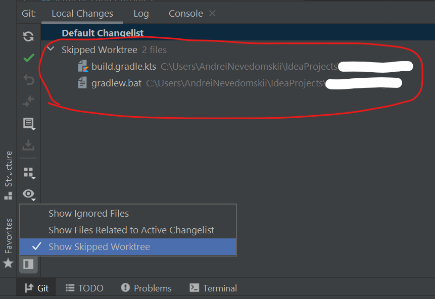

# Git extended update-index plugin
IntelliJ IDEA plugin to add the extended support of the `git update-index` command.

It adds the support for the next subcommands:
 - --skip-worktree
 - --no-skip-worktree
 - --chmod=+x
 - --chmod=-x

## Screenshots

## Release History
* 0.1.1
  * Use the latest IntelliJ API.
* 0.1.0
  * Introduced a way to see skipped worktree files in the changes view tool window. 
* 0.0.5
  * Run the commands in a background task (fixes the exception).
* 0.0.4
  * Switched to modern IntelliJ API.
  * Set Java 11 as compile target.
  * Use the latest Kotlin compiler.
* 0.0.3
    * Rewrote the plugin in Kotlin.
    * Switched to modern IntelliJ API.
    * Added a plugin icon.
* 0.0.2
    * Updated dependencies to make the plugin available on all platforms.
* 0.0.1
    * Initial release.
    
## License
The software is licensed under the [Apache-2.0 License](LICENSE).
